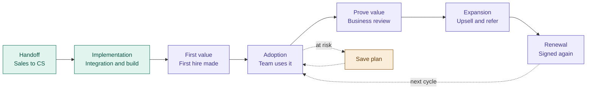

# Customer Lifecycle Map: From Handoff to Renewal

## The Map

Green steps were already documented. Purple steps are new. The amber box is the save plan for accounts that show risk.

## Each Stage, and How We Know It Is Done

A step without a finish line is just a vibe, so every stage has a clear exit point.

| Stage | What happens | Owner | Done when |
|---|---|---|---|
| Handoff | Sales passes the account, scope, contacts, and any promises made during the sale to CS | Sales, then CS | CS has everything needed to run kickoff |
| Implementation | Engineering connects the customer's applicant tracking system, CS builds the assessments | CS and Engineering | Assessments are live and candidates have been invited |
| First value | The customer uses a score to make a real hiring decision | CS | First hire made using the platform |
| Adoption | The whole team uses the platform as a habit, not just one person | CS | Core features are used without CS prompting |
| Prove value | Business review with the decision maker, results shown in their language | CS | The executive sponsor agrees it is working |
| Expansion | Ask for more: new locations, new roles, a testimonial, a referral | Agreed with revenue team | Expansion signed or referral made |
| Renewal | Starts 90 to 120 days before contract end: health check, sponsor conversation, paperwork | CS, with revenue and contracts | New contract signed |

Pilot customers take a shorter path. For them, renewal really means converting from pilot to paid, and the Pilot Customers Conversion Strategy playbook covers that.

## What Real Accounts Taught Me

**Going live is not the finish line.** Early on we treated "assessments live" as success. Then I watched a team download reports without reading them and skip the comparison tool entirely. The product was live, but the habit was not. That gap is why Adoption is its own stage.

**Customers did not understand the scoring.** Across accounts, people were unsure how answers became scores, whether candidates could game the system, and how to share results. If a customer cannot explain the score, they cannot defend the purchase at renewal time.

**Renewal starts on day one.** By the time a contract is 30 days from ending, the decision is already made. The work in First value, Adoption, and Prove value is the renewal conversation, just spread out over the year.

## The Seams Between Teams

The handoffs between departments are where accounts get dropped, so I flagged three ownership questions to settle with the revenue team before finalizing:

1. Who owns expansion deals?
2. Who owns the pilot to paid conversion?
3. Who leads the commercial conversation at renewal?

Answering these together means the post sale map plugs straight into the revenue team's lead to sale map instead of competing with it.
